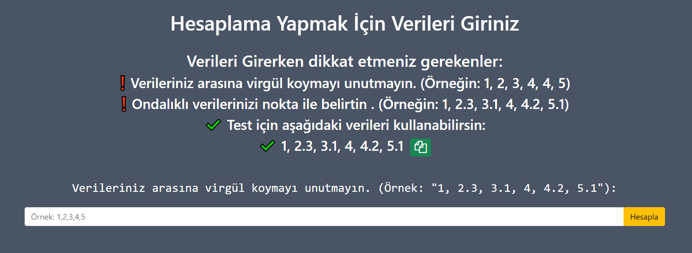
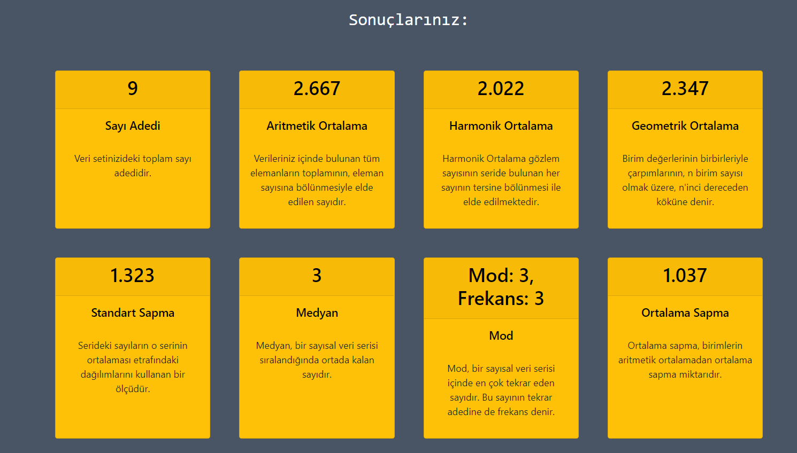
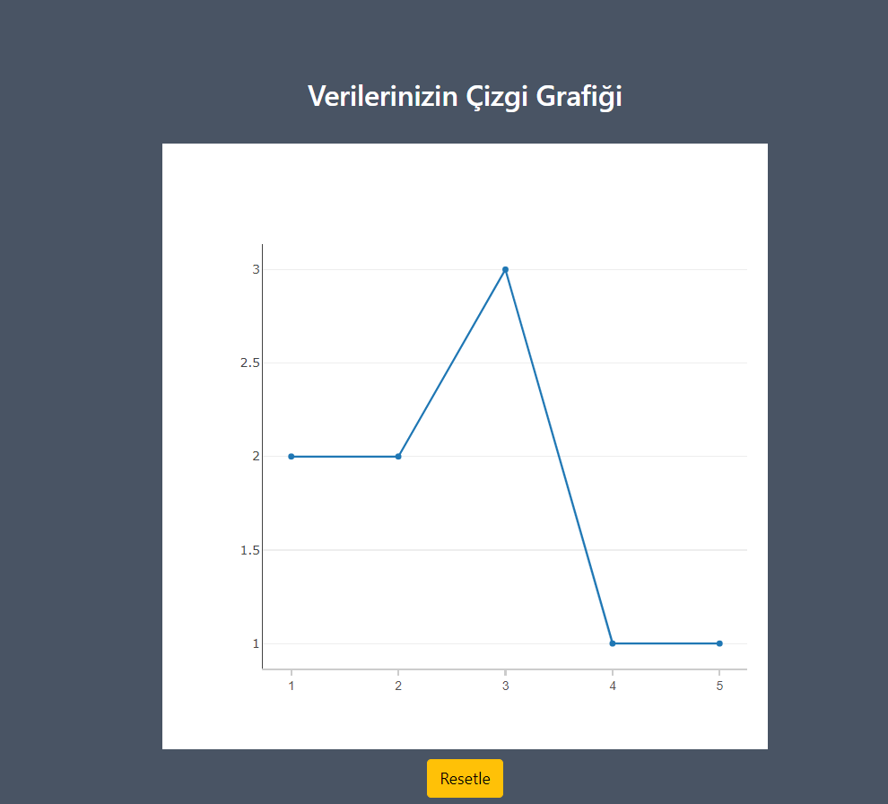
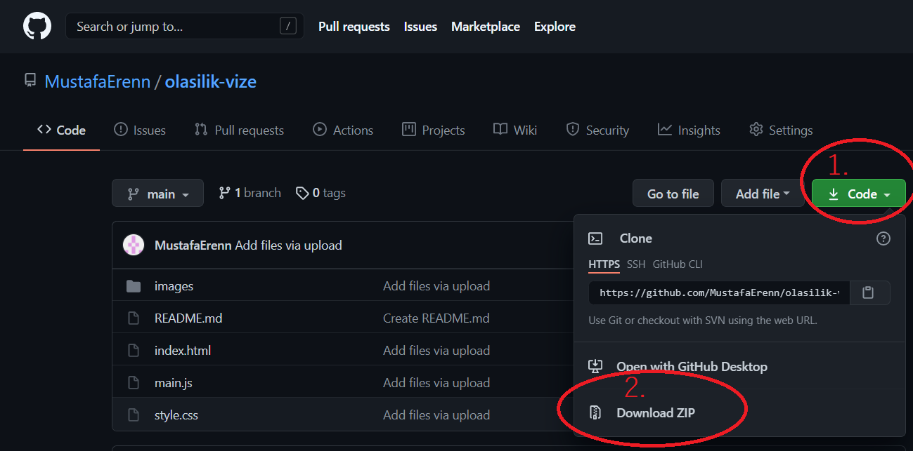

# Olasılık ve İstatistik Vizesi-Grup Ödevi

Siteye [buraya](https://mustafaerenn.github.io/olasilik-vize/) tıklayarak ulaşabilirsiniz.

# Genel Özet
Bu proje  BTU-Olasılık ve İstatistik dersi için yaptığımız grup projesidir.
## Proje Amacı
Temel istatistik hesaplarını(aritmetik ortalama,standart sapma,mod gibi) verilerinize göre hesaplayan yapan bir websitesi yapmak.

## Nasıl Kullanılır?
Verilerinizi giriş kısmına virgül ile ayırarak girip hesapla butonuna basmanız yeterli. Bütün hesaplamarı yaptıktan sonra sonuçları kartlar şeklinde ekrana basar.

# Yapılan Hesaplamalar
- Verilerinizin Sayı Adedi
- Aritmetik Ortalama
- Harmonik Ortalama
- Geometrik Ortalama
- Standart Sapma
- Medyan
- Mod
- Ortalama Sapma
- Varyans

# Siteden görüntüler

Verilerinizi girmeniz için böyle bir ekranla karşılaşacaksınız. Gerekli alana virgül ile sayılarınızı girdikten sonra hesaplaya basın

Sonuçlarınız resimde görüldüğü gibi ekrana basılacaktır.

Sayfanın sonunda ise sayılarınızın adedini gösteren bir çizgi grafiği mevcut.

# Kullanılan Teknolojiler
- HTML
- JavaScript
- CSS

# Kurulum
## Github üzerinden indirmek

Resimdeki adımları takip ederek kodu zip olarak indirdikten sonra zipi açarak dosya içindeki index.html'e çift tıklayarak açarsanız siteyi kullanabilirsiniz.

## Site Linki
Kodu indirmek istemezseniz linkten kullanabilirsiniz -> https://mustafaerenn.github.io/olasilik-vize/

# Ekip Üyeleri
- Mustafa Eren ->  [@MustafaErenn](https://github.com/MustafaErenn)
- Kerem Ersu ->  [@keremersu35](https://github.com/keremersu35)
- Taner Solak ->  [@tanersolak](https://github.com/tanersolak)

